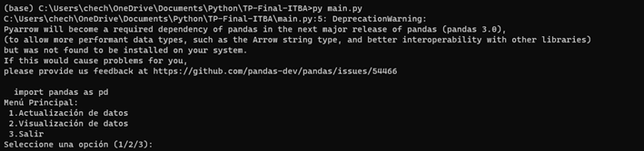
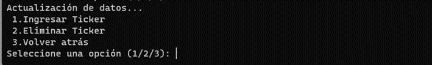
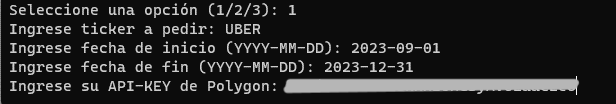
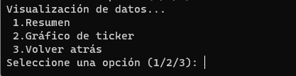
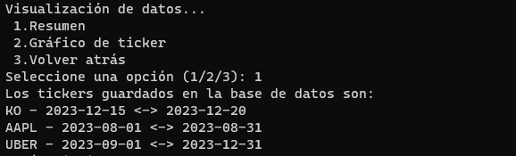
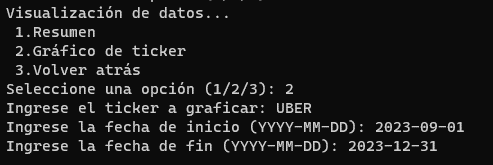
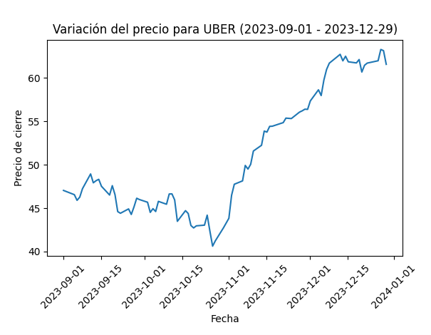

# TP Final Certificación Profesional Python

## Descripción

Desarrollar un programa que cargue información de acciones y permita visualizarla.

## Objetivo

Este programa es el Proyecto Final de la [Certificación Profesional en Python](https://innovacion.itba.edu.ar/educacion-ejecutiva/tic/python/) del ITBA. El objetivo es crear un programa que permita recolectar datos de la API de finanzas de [Polygon](https://polygon.io/) para analizar la evolución del valor de una acción. 

El flujo del programa es:
* recolecta información del sitio
* almacena la información en una base de datos
* permite al usuario visualizar la evolución de la acción solicitada. 

El usuario podrá visualizar un resumen de dicha información e incluso solicitar un gráfico para su análisis, para ello el programa solicitará ciertos parámetros que el usuario deberá proporcionar para poder identificar la información correspondiente.

### Integrantes del Grupo

* [Christian Armenteros](https://www.linkedin.com/in/carmenteros2001/): carmenteros2022ai@gmail.com
* [Emanuel Menager](https://www.linkedin.com/in/emanuel-menager-785b41269/): emanuelmenager2003@gmail.com
* [Leonardo Alexis Cordoni](https://www.linkedin.com/in/acordoni/): alexiscordoni@gmail.com
* [Sergio García Mora](https://www.linkedin.com/in/sergiogarciamora/): serggarcia@itba.edu.ar

## Implementación del programa

El programa trabaja con **Polygon.io**, esto quiere decir que para poder utilizarlo el usuario necesitará obtener una API-KEY para lograr solicitar información.

Para obtener la API-KEY se deberá acceder al [siguiente link](https://polygon.io/docs/stocks/getting-started)
Una vez en la página de Polygon.io, es necesario que el usuario este registrado y haya iniciado sesión. Teniendo esto en cuenta habrá un botón en la parte superior derecha de la página *"Dashboard"*, al colocar el cursor sobre el botón se desplegará una lista de opciones, acceder a la opción *"API Keys"* haciendo click en ella. Finalmente aparecerá en pantalla una tabla con todas las api keys que el usuario posea, en el caso de que nunca haya agregado una api key, se mostrará con el name *"Default"* y a su derecha el código de la api key que se debe copiar para utilizar en el programa.

A través del programa se podrán solicitar cuatro tipos de índices (TICKERS) que Polygon nos brinda: Stocks/Equities, Índices, Forex y Crypto.

Para poder solicitar información de alguno de estos índices, el programa nos pedirá el nombre del TICKER (por ejemplo, *UBER*), la fecha de inicio y la fecha de fin y la API KEY de Polygon.

> Para ingresar las fechas correctamente éstas deben seguir el formato año-mes-día, YYYY-MM-DD. Por ejemplo si se quiere indicar el 21 de febrero de 2023 se debe escribir 2023-02-21.

Si los datos ingresados son correctos se guardará la información en una base de datos.

Con la información en la base de datos el usuario podrá acceder a un resumen, en el cual se visualizarán todos los tickers almacenados, indicando por fila cada solicitud que se haya realizado exitosamente con el siguiente formato:

`TICKER - FECHA DE INICIO(YYYY-MM-DD) <-> FECHA DE FIN (YYYY-MM-DD)`

Por otro lado, el usuario también podrá visualizar un gráfico el cual presentará la variación del valor del TICKER durante periodo solicitado.

# Uso del programa

Luego de ubicar los archivos en una carpeta local ejecutar la siguiente instrucción en una terminal:

```
py main.py
```

Esto dará inicializará el programa, y observaremos una pantalla similar a esta:



Para extraer datos de **Polygon** seleccionamos la opción 1, *Actualización de datos*. Lo cual abrirá el siguiente menú:



- La opción *Ingresar Ticker* permite ingresar datos nuevos a la base de datos.
- La opción *Eliminar Ticker* permite eliminar tickers de la base de datos
- La última opción, *Volver atrás*, retorna al menú inicial.

Al elegir la opción 1, *Ingresar Ticker* el programa solicitará:
- Nombre del Ticker
- Fecha de inicio del período a consultar
- Fecha del final del período de consulta
- El código de la API KEY de Polygon

Acá se puede ver un ejemplo:



Si el paso anterior fue exitoso, se volverá a ver el menú inicial. Para ver la información disponible se podrá elegir la opción 2, *Visualización de datos* que abrirá el siguiente menú:



El menú de visualización contiene las siguientes opciones
- *Resumen*: Permite ver qué información está almacenada en la base de datos.
- *Gráfico de ticker*: Permite generar una visualización con la evolución del precio del ticker.
- *Volver atrás*: Retorna al menú anterior.

Si ejecutamos la opción 1, *Resumen*, el programa mostrará el código del, o de los tickers almacenados en la base de datos.



Para realizar un gráfico seleccionar las opciones *Visualización de datos* -> *Gráfico de ticker* y el programa pedirá al usuario que ingrese:
- Nombre del ticker
- Fecha de inicio del gráfico
- Fecha de fin de la consulta

> Recordar que las fechas deben ingresarse en el formato `YYYY-MM-DD` (año, mes, día)

A continuación, un ejemplo:



Finalmente, se abrirá una ventana que mostrará un gráfico de líneas, indicando la evolución del valor de la acción o ticker seleccionado durante el período ingresado.



Para realizar otro gráfico, sólo se debe cerrar la ventana del gráfico y repetir los pasos anteriores.

## Próximos pasos: Extras

Nuestras capacidades nos trajeron hasta aquí, a continuación, detallaremos algunas de las mejoras que planeábamos incorporar.

Desarrollar un archivo ejecutable para que el programa simplemente se ejecute al abrir ese archivo.

Crear una interfaz gráfica para que la navegación a través de los menús sea más amigable.

El programa avisará al usuario en el caso de que la solicitud deseada no sea válida o haya un dato erróneo, mediante el siguiente mensaje: "Error al hacer la solicitud a la API. Código de error: {json_file.status_code}".

El usuario podrá organizar la base de datos, ya que el programa tiene una opción para eliminar datos de una manera sencilla. Se solicitará el nombre del TICKER, la fecha de inicio y la fecha de fin para identificar la información.

El programa cuenta con una función de verificación a partir de la cual notificará al usuario si la operación se realizó se manera exitosa o si hubo algún problema.

Mejorar los mensajes de error, haciendo sugerencias sobre cuál pudo haber sido el error y cómo se puede corregir.